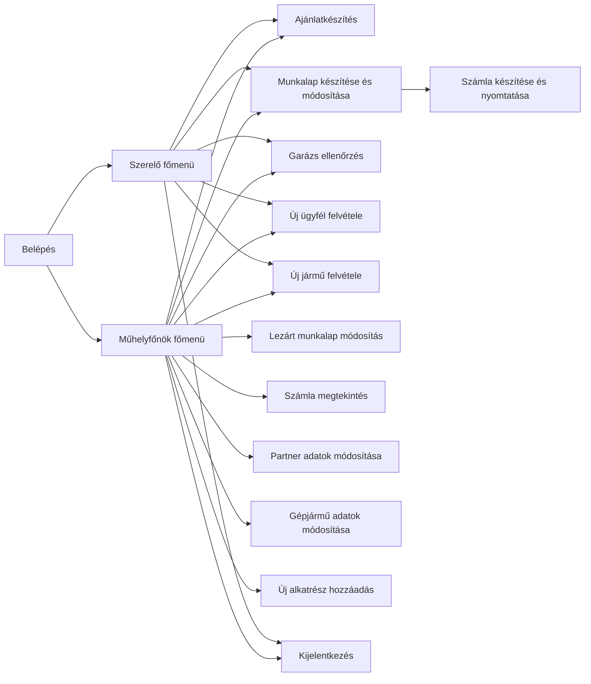

# Autószerviz

## Beadandó projektfeladat
## Tárgy: Informatikai projektfeladat (L_KZ01_Informatikai_projektfeladat_L-K-GINFBAL-INFOPROJ-1-KZ01_22-23-2)
## Intézmény: Neumann János Egyetem (Kecskemét)
## Kar: GAMF - Műszaki és Informatikai Kar

### Készítették:

|	Név     	 |     Neptun kód                |    	  Szak                 |
|----------------|-------------------------------|-----------------------------|
|`Kanta Csaba` |`RAK0Z5`				 |`Mérnök informatikus Bsc`    |
|`Regéczy Ákos` |`K6N69Q`				 |`Mérnök informatikus Bsc`    |
|`Várhegyi-Miłoś Ádám` |`Y1JE9I`				 |`Mérnök informatikus Bsc`    |
|`Zellei Krisztián`    |`MFY3QA`				 |`Mérnök informatikus Bsc`    |
|`Csabai Albert`       |`EZS38V`            	 |`Mérnök informatikus Bsc`    |

## Alkalmazás főbb céljai

Egy olyan szoftver készítése, ami teljes mértékben lefedi egy autószerelő műhely munkáját.

Az alkalmazás használata a műhelyben dolgozó személyzet munkájának elvégzéséhez használatos.
Az indítás után bejelentkezés szükséges. Két jogosultsági szinttel használható a szoftver (szerelő és műhelyfőnök).

Az alábbi táblázatban megtekinthetőek az alkalmazás főbb funkciói:

* Szerelőként:
  * Ajánlatok készítése
  * Munkalapok készítése, módosítása és lezárása
  * Számla készítése munkalap alapján és annak nyomtatása
  * Új ügyfelek felvétele
  * Új járművek felvétele
  * Garázs foglaltságok visszaellenőrzése.
  
* Műhelyfőnökként:
  * Ajánlatok készítése és módosítása 
  * Munkalapok készítése, módosítása és lezárása
  * Lezárt munkalapok módosítása
  * Számla készítése mnkalap alapján és annak nyomtatása
  * Lezárt számla megtekintése
  * Új ügyfelek felvétele
  * Ügyfél adatok módosítása
  * Új járművek felvétele
  * Jármű adatok módosítása
  * Garázs foglaltságok visszaellenőrzése
  * Új alkatrészek felvétele a rendszerbe.

## Felhasználói tevékenység áramlása UML diagram segítségével

